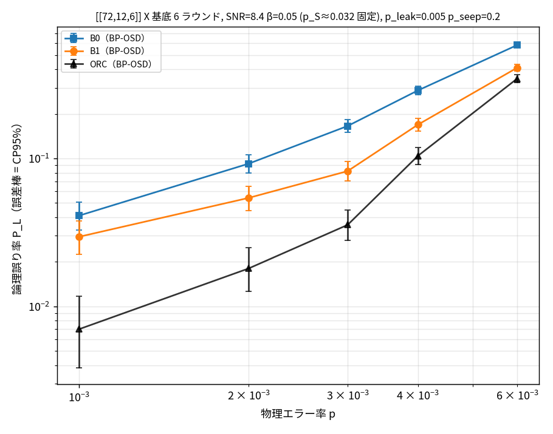
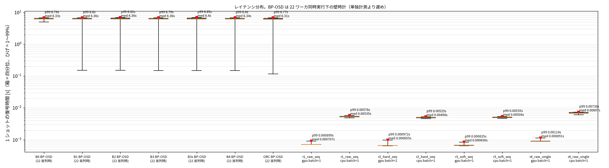

# 量子誤り訂正：リーク誤りの「持続性」を学習する soft デコーダ

高レート量子 LDPC 符号（Bivariate Bicycle 符号 [[72,12,6]]）の復号において、
**超伝導量子ビットのリーク誤りを、測定のアナログ値の時間変化から推定する**学習型デコーダの研究。

既存手法が取れていなかった誤りを回収し、**論理誤り率を 0.159 → 0.1245（達成可能な上限の 65%）に改善**した。
改善が「時間方向」と「空間方向」のどちらから来ているかを統計的に分離したところ、**両方が有意に寄与**していた。

> **Summary (EN).** Superconducting qubits occasionally *leak* out of the computational subspace, and a leaked
> readout carries no information about the syndrome — yet existing decoders either ignore this or apply a
> per-shot heuristic with, as both prior papers state, no theoretical grounding. This work shows that per-shot
> leakage handling is provably worthless at realistic leakage rates, and that a Transformer trained on raw IQ
> measurements recovers 65% of the available headroom by exploiting the *temporal persistence* of leakage.
> The time-direction and code-structure contributions are separated and both are statistically significant.

---

## 1. 解いている問題

量子計算では、計算中に生じる誤りを**誤り訂正符号**で訂正し続ける必要がある。補助量子ビットを繰り返し測定して
「どこで誤りが起きたか」の手がかり（シンドローム）を集め、そこから誤りを推定する処理を**復号**と呼ぶ。

この研究が扱うのは、その入力が壊れる特殊な誤り — **リーク誤り**である。

超伝導量子ビットは $|0\rangle$ と $|1\rangle$ の 2 状態で計算するが、まれに**その外の状態 $|2\rangle$ に飛び出す**
（リーク）。リーク中の量子ビットを読み出しても、返ってくる値は**本来のシンドロームと何の関係もない**。
さらに厄介なことに、リークは**一度起きると数ラウンド持続する**。

**既存手法の限界**：読み出しは実際には 0/1 ではなく IQ 平面上の点（アナログ値）として返ってくる。
先行研究はこの 1 点を見てリークを判定し、該当する測定を「情報なし」として扱う前処理を提案しているが、
Hanisch ら・Riverlane の両論文とも**その判定に理論的根拠がないことを自ら認めている**。

**この研究の主張**：1 点を見る限りリークは原理的に検出できない。**同じ量子ビットを時間方向に追って初めて**
識別できる。そしてその推論は学習できる。

<details>
<summary>なぜ 1 点では無理なのか（実測値つき）</summary>

リーク状態の分布は、$|0\rangle$ と $|1\rangle$ の**ちょうど中間＝硬判定の境界の真上**に置かれる。
つまりリーク中の測定は「どっちつかずの位置に落ちた正常な測定」と見た目が同じになる。

IQ 平面全体を走査しても、$|2\rangle$ の事後確率は最大 0.158 にしかならず（$|1\rangle$ の 0.466 に負ける）、
**最適な 3 状態判別器ですら 115 万個の測定を一度もリークと判定しない**。

しかもリーク中の点は広がって落ちるため、**リーク測定の 53% に対して、既存手法は「9 割以上信用してよい」と
誤った確信度を与えている**（真の値は 0.5＝情報ゼロ）。リークの害は曖昧さではなく**自信を伴う誤り**である。

一方、同じ量子ビットの 8 ラウンドを並べると識別できる：

```
--- 実際にリークしていた量子ビット ---
  1点ごとの推定 : 0.006 0.002 0.120 0.102 0.118 0.148 0.007 0.147  ← 検出できない
  時間方向の推定: 0.042 0.083 0.656 0.786 0.817 0.805 0.691 0.677  ← 検出できる
```
</details>

## 2. 手法

| 軸 | 内容 |
|---|---|
| 1 | リークの**持続性**を学習する（既存は IQ 点ごとの独立判定） |
| 2 | アナログ値を**潰さない**（測定ごとの生の (I,Q)。検出器への合成を経由しない） |
| 3 | **レイテンシ一定**（誤りパターンに依らず固定時間で終わる） |

**モデル**：測定 576 個（72 補助量子ビット × 8 ラウンド）をトークンとする Transformer（6 層、d=128、1.29M パラメータ）。
位置は量子ビット埋め込みとラウンド埋め込みの和。出力は 2 つ — 論理誤り 12 ビットと、**測定ごとのリーク確率**。

**評価の設計**：リーク推論の質だけを比べるため、**後段の復号器を BP-OSD に固定**し、
「測定ごとの反転確率 $p_S$ を誰が作るか」だけを差し替えた。同一の 2000 ショットで対応のある比較を行っている。

## 3. 結果

### 主要結果：改善がどこから来ているかの分離

| $p_S$ の作り手 | 使う情報 | 論理誤り率 | 有意性 |
|---|---|---|---|
| 既存手法（1 点 soft） | なし | 0.1590 | — |
| 既存手法＋1 点リーク判定 | なし（**判定が一度も発火しない**） | 0.1590 | 効果 0 |
| Hanisch 流の外れ値検出 | 円形境界 | 0.1720 | **悪化**（適合率 2.7%） |
| 1 点の Bayes 最適 | 1 点の事後確率 | 0.1615 | 差なし |
| 古典 HMM（自作の強いベースライン） | **時間のみ** | 0.1345 | |
| **本手法（単発版）** | **空間のみ** | 0.1405 | vs 1 点最適 **p = 0.0007** |
| **本手法（系列版）** | **時間 × 空間** | **0.1245** | vs 既存 **p = 5e-6** |
| オラクル（真のリーク位置を与える） | 反則 | 0.1060 | 到達可能な上限 |

- **既存の per-shot リーク処理は効果が 0**（判定が発火しない／Bayes 最適でも差なし）、Hanisch 流は**有害**
- 本手法は**オラクルとの差 0.053 のうち 65% を回収**
- **時間方向の寄与 0.016（p = 0.018）、空間方向の寄与 0.021（p = 0.0007）で、どちらも有意**
- 古典 HMM に対しては 0.1245 対 0.1345 で**方向は勝っているが未決着**（p = 0.10、1 万ショットで再測定予定）

### 物理エラー率に対する振る舞い



hard 復号（B0）と soft 復号（B1）の差、および真のリーク位置を与えたときの上限（ORC）。
0 誤り区間は Clopper-Pearson 95% 上側限界で扱い、**BB 符号では誤り抑制係数 Λ を使っていない**
（同じ多項式ファミリーでないため、この符号族では定義できない）。

### レイテンシ



学習型は **GPU 0.7 ms / CPU 5 ms**、BP-OSD は **6.3 秒**で 3〜4 桁の差。
ただしこの利点は end-to-end 構成にのみ付き、本研究の主結果（hybrid）は後段に BP-OSD を使っている。

## 4. 設計上の判断と、外れた仮説

研究そのものより、**判断の過程**を残すことを重視した。主なものを挙げる。

**弱いベースラインを作らないこと**
- BP-OSD は `schedule="serial"` 必須と実測で確定させた（`parallel` では BP がほぼ収束せず **LER が 15.6 倍悪化**）。
  弱い比較対象に勝っても主張にならない
- 先行研究の手法（円形境界）に勝つだけでは不十分と考え、**「1 点情報の Bayes 最適」と「時間方向の古典最適（HMM）」を
  自分で実装して**比較対象に加えた。HMM には真の生成モデルのパラメータを与えており、学習型より条件が有利である

**実験が仮説を否定したとき、それを記録した**
- **計画時の「soft 化でレイテンシのテールが発散する（p99 = 114 秒）」は再現しなかった**（実測は p99/中央値 = 1.07）。
  主張を「テールレイテンシ」から「秒オーダー対ミリ秒オーダー」に変更した
- **「アナログ値を潰さない」効果は end-to-end の論理誤り率には現れなかった**（論理誤り率は raw 0.417 に対し soft 0.375 で、潰した方が良かった）。
  一方でリーク推論では raw が最良（AUC 0.973 > 0.952 > 0.867）だったため、**主戦場を end-to-end から hybrid に移した**
- 当初の対照実験（時間方向を殺したモデルとの比較）に**交絡があることを自己監査で発見**し、
  復号器を揃えた hybrid 比較に設計を変更した

**実装の妥当性を先に固めた**
- Phase 1 の最後に**関門**を置き、「リーク無し・雑音ゼロで既存サンプラと厳密一致」「分布が解析式と一致」
  「soft が hard に勝つ」の 3 条件を満たすまで先に進まない運用にした
- 自分の実装を 16 項目にわたって**監査**し、結果に効くもの（対照実験の交絡、掃引時の変数の混入、
  レイテンシ計測条件の不備など）を `TODO.md` に記録した

**理想化の明示**：本シミュレータのリークは読み出しのみを壊し、データ量子ビットへの誤り伝播は含まない。
したがってオラクルの 0.106 も「読み出しの破壊を完全に補償した場合」の上限である。

## 5. 検証

- **テスト 86 件**（`pytest`）。受け入れ基準を先に決めてから実装する方式で、例：
  - `boxplus(6.0, 0.5) == boxplus(0.5, 6.0) ≈ 0.50`（情報損失の実証）
  - 読み出し誤り率が測定時間に対して**極小を持つ**（最適測定時間が存在する）
  - リーク持続長を 1 にすると**厳密に i.i.d. になる**（機構証明の対照条件が成立する）
  - 固定バッチへの過学習で loss → 0（モデルの表現力と実装の確認）
- 数値的な安定性：$|L| = 10^6$ でも `boxplus` が有限、式(8) は全域を対数空間で計算し、
  `erfc` の差の桁落ちを反射公式で回避

## 6. コードの構成

```
leakdec/
├── sim/       シミュレータ：Stim 回路、測定→検出器写像、3 状態 IQ モデル、
│              リーク持続過程（2 状態マルコフ）、ショット生成
├── decode/    古典デコーダ：BP-OSD ラッパと、比較対象となる各 p_S 生成手法
├── learn/     学習型デコーダ：Transformer 本体、オンラインデータローダ、学習ループ
└── analysis/  評価：対応のある比較、Clopper-Pearson、McNemar、レイテンシ、作図
scripts/       実験ドライバ（関門テスト、ベースライン一括実行、パラメータ掃引）
tests/         pytest 86 件
docs/          開発ガイド、結果の詳細、手法の早見表
```

依存の向きは `sim → decode / learn → analysis` の一方向に保っている。

## 7. もっと読む

| ドキュメント | 内容 |
|---|---|
| [docs/progress_20260925.md](docs/progress_20260925.md) | **全結果の数値**、計画から修正した点、残タスクの優先順位 |
| [docs/models_cheatsheet.md](docs/models_cheatsheet.md) | 各比較手法が何をしているかの解説（数式の導出つき） |
| [docs/DEVELOPMENT.md](docs/DEVELOPMENT.md) | 環境構築と実行コマンド |
| [TODO.md](TODO.md) | 実装 TODO、受け入れ基準、自己監査 16 項目 |
| [RULES.md](RULES.md) | 守るべき制約（過去に踏んだ地雷の記録） |

## 8. 環境

Python 3.10 / PyTorch 2.14（CUDA 13）/ NVIDIA RTX 6000 Ada。
量子回路シミュレーションは [Stim](https://github.com/quantumlib/Stim)、古典復号は [ldpc](https://github.com/quantumgizmos/ldpc)（BP-OSD）。

```bash
uv pip install --no-deps -e .
python -m pytest -q
```

実行方法の詳細は [docs/DEVELOPMENT.md](docs/DEVELOPMENT.md)。

---

*本研究は進行中であり、結果は査読を経ていない。*
